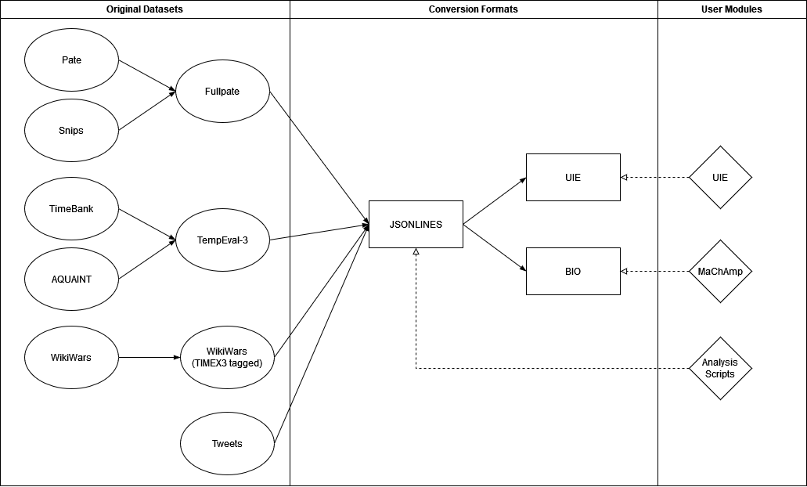

# Introduction

This repository provides the models and the source code for the master's thesis "Extraction and Classification of Time in Unstructured Data" (2023).
Furthermore, it describes the steps required to reproduce the thesis results.
The transformer-based models are finetuned to extract and classify temporal expressions in unstructured text.

The models produced by the thesis utilize the two frameworks, UIE and MaChAmp.
Both repositories were forked in August 2023 and modified to suit the problem of temporal extraction and classification.
Most changes were applied to the evaluation and dataset preprocessing scripts.
The scripts for finetuning and inference remain very close to the original versions:

* Unified Structure Generation for Universal Information Extraction (UIE) [[Lu et al., 2022]](#References) - [GitHub Link](https://github.com/universal-ie/UIE)
    * UIE is a sequence-to-sequence framework that extracts various information extraction targets (such as entities, relations and events) into a graph structure called "Structured Extraction Language". It is based on the T5 library [[Raffel et al., 2020]](#References).
* Massive Choice, Ample Tasks (MACHAMP) [[van der Goot et al., 2020]](#References) - [GitHub Link](https://github.com/machamp-nlp/machamp)
    * MaChAmp is a multitask learning framework. In this thesis, it is used to train BERT-based models in a single-task fashion.

In the thesis a 10-fold-crossvalidation approach was chosen to test the two frameworks.
In this documentation, both a quickstart and a full reproduction of all the steps are described.
Both approaches are described for each of the two frameworks seperately.

The steps for the two frameworks are almost the same, but they are achieved using different scripts and conventions, which are described in detail in the respective documentation.
The documentation for [UIE](uie) and [MaChAmp](machamp) can be found in the folders with the same name.
This pages only gives some general information, introduces the project and refers to the necessary pages.


## Project Overview

The overall projectstructure looks like this:

```text
temporal-extraction
├── uie                 # Contains all the scripts and documentation related to UIE
├── machamp             # Contains all the scripts and documentation related to MaChAmp
├── results             # Contains the result tables and logfiles of the finetuned models used in the theis 
├── temporal-data       # Contains the datasets, as well as the scripts required for conversion
```

This is the main directory (temporal-extraction).
Both [uie](uie) and [machamp](machamp) contain the framework-specific documentation required to both use the models and fully reproduce the steps in the thesis.

The [results](results) folder shows the result tables and logfiles produced by the thesis.
In particular, it shows the results for every dataset and every fold in the crossvalidation.
Furthermore, it contains the files that display the exact error cases i.e. where the model mispredicted the sentence.

The [temporal-data](temporal-data) folder contains all the converted datasets, as well as the publicly available original versions.
It also contains the scripts required to convert the original datasets into the required format.


## Data

There are multiple data formats that can be found in this repository.
First, each of the used datasets follows a general XML or JSON format.
Despite this, most of the datasets have a different format and are therefore not directly comparable.

[](#data)
> The graphic shows the datasets, formats and the relations between them.

In the [temporal-data section](temporal-data) the different formats are described in more detail, as well as the scripts to convert them into a uniform format.
In summary, the thesis uses four datasets, of which some consists of multiple subsets (for example TempEval-3 is a union of AQUAINT and TimeBank).
The MaChAmp frameworks requires a BIO format, while UIE has its own format based on JSON.
Furthermore, the author of the thesis introduced a JSONLINES format, which is used as a step to convert to the other formats.


## Anaconda

To use this repository it is recommended to use Anaconda.
With Anaconda, a seperate environment can be created for each of the two frameworks.
From this directory the following commands may be used:

UIE:
``` bash
conda create -n uie python=3.8
conda activate uie
pip install torch==1.8.0+cu111 torchvision==0.9.0+cu111 torchaudio==0.8.0 -f https://download.pytorch.org/whl/torch_stable.html
pip install -r uie/requirements.txt
```

MaChAmp:
``` bash
conda create -n machamp python=3.8
conda activate machamp
pip install -r machamp/requirements.txt
```


# Reproduction Steps Summary

Before the models are used, it is recommended to prepare the [data](temporal-data) first.

## Quickstart
* Setup Anaconda environment
* Prepare the data
* Download the finetuned models
* Select dataset and run the inference script


## Reproduce the thesis steps
* Setup Anaconda environment 
* Prepare the data
* Prepare the crossvalidation approach
* Download the clean UIE models
* Finetune the models on each of the folds
* Run the crossvalidation evaluation scripts to get the results


# Clean UIE Models

The following two models should be used for finetuning.
These are the same models as proposed in the original paper [[Lu et al., 2022]](#References).

* UIE Base: [ZFDM Download](https://www.fdr.uni-hamburg.de/record/13712), [Google Drive Download](https://drive.google.com/file/d/12Dkh6KLDPvXrkQ1I-1xLqODQSYjkwnvs/view)
* UIE Large: [ZFDM Download](https://www.fdr.uni-hamburg.de/record/13714), [Google Drive Download](https://drive.google.com/file/d/15OFkWw8kJA1k2g_zehZ0pxcjTABY2iF1/view)


# Finetuned Models

The thesis tested a single and a multi class setup on all datasets and their subsets.
Due to the large amount of models, only the multi class (date, time, duration, set) models  on the four temporal datasets are shared and made available for download.
Generally speaking, the single class models do not perform much better despite an easier task.
This makes the single class models obsolete in practice.
The following table shows the mutliclass results on the different datasets:

[](#finetuned-models)
> Table shows the temporal extraction and classification performance for the models produced in the thesis. M stands for MaChAmp models. The bottom part of the table shows the performance of related work. "Strict" means an exact match and "Type" means a match where at least one token (also known as "relaxed" match) and the temporal class is correct.


## UIE Models

[UIE GitHub Link](https://github.com/universal-ie/UIE), [[Lu et al., 2022]](#References)

| Dataset                        | Base                                                            | Large                                                            | Citation                                                                  |                              
|-------------------------------:|----------------------------------------------------------------:|-----------------------------------------------------------------:|---------------------------------------------------------------------------|
| TempEval-3                     | [Download Link](https://www.fdr.uni-hamburg.de/record/13599)    |  [Download Link](https://www.fdr.uni-hamburg.de/record/13615)    | [[UzZaman et al., 2013]](#References)                                     |                  
| WikiWars                       | [Download Link](https://www.fdr.uni-hamburg.de/record/13595)    |  [Download Link](https://www.fdr.uni-hamburg.de/record/13617)    | [[Derczynski et al., 2012]](#References)                                  |          
| Tweets                         | [Download Link](https://www.fdr.uni-hamburg.de/record/13597)    |  [Download Link](https://www.fdr.uni-hamburg.de/record/13619)    | [[Zhong et al., 2017]](#References)                                       |          
| Fullpate                       | [Download Link](https://www.fdr.uni-hamburg.de/record/13601)    |  [Download Link](https://www.fdr.uni-hamburg.de/record/13621)    | [Zarcone et al., 2020](#References)                                       |    


## MaChAmp Models

### MaChAmp-BERT Models 

[Base Model Huggingface Link](https://huggingface.co/bert-base-cased), [Large Model Huggingface Link](https://huggingface.co/bert-large-cased), [[Devlin et al., 2018]](#References)

| Dataset                        | Base                                                            | Large                                                            | Citation                                                                  |                              
|-------------------------------:|----------------------------------------------------------------:|-----------------------------------------------------------------:|---------------------------------------------------------------------------|
| TempEval-3                     | [Download Link](https://www.fdr.uni-hamburg.de/record/13698)    |  [Download Link](https://www.fdr.uni-hamburg.de/record/13706)    | [[UzZaman et al., 2013]](#References)                                     |                  
| WikiWars                       | [Download Link](https://www.fdr.uni-hamburg.de/record/13702)    |  [Download Link](https://www.fdr.uni-hamburg.de/record/13710)    | [[Derczynski et al., 2012]](#References)                                  |          
| Tweets                         | [Download Link](https://www.fdr.uni-hamburg.de/record/13700)    |  [Download Link](https://www.fdr.uni-hamburg.de/record/13708)    | [[Zhong et al., 2017]](#References)                                       |          
| Fullpate                       | [Download Link](https://www.fdr.uni-hamburg.de/record/13696)    |  [Download Link](https://www.fdr.uni-hamburg.de/record/13704)    | [Zarcone et al., 2020](#References)                                       |    


### MaChAmp-RoBERTa Models 

[Base Model Huggingface Link](https://huggingface.co/roberta-base), [Large Model Huggingface Link](https://huggingface.co/roberta-large), [[Liu et al., 2019]](#References)

| Dataset                        | Base                                                            | Large                                                            | Citation                                                                  |                              
|-------------------------------:|----------------------------------------------------------------:|-----------------------------------------------------------------:|---------------------------------------------------------------------------|
| TempEval-3                     | [Download Link](https://www.fdr.uni-hamburg.de/record/13681)    |  [Download Link](https://www.fdr.uni-hamburg.de/record/13623)    | [[UzZaman et al., 2013]](#References)                                     |                  
| WikiWars                       | [Download Link](https://www.fdr.uni-hamburg.de/record/13686)    |  [Download Link](https://www.fdr.uni-hamburg.de/record/13627)    | [[Derczynski et al., 2012]](#References)                                  |          
| Tweets                         | [Download Link](https://www.fdr.uni-hamburg.de/record/13683)    |  [Download Link](https://www.fdr.uni-hamburg.de/record/13629)    | [[Zhong et al., 2017]](#References)                                       |          
| Fullpate                       | [Download Link](https://www.fdr.uni-hamburg.de/record/13679)    |  [Download Link](https://www.fdr.uni-hamburg.de/record/13625)    | [Zarcone et al., 2020](#References)                                       |           


### MaChAmp-XLM-RoBERTa Models 

[Base Model Huggingface Link](https://huggingface.co/xlm-roberta-base), [Large Model Huggingface Link](https://huggingface.co/xlm-roberta-large), [[Conneau et al., 2019]](#References)

| Dataset                        | Base                                                            | Large                                                            | Citation                                                                  |                              
|-------------------------------:|----------------------------------------------------------------:|-----------------------------------------------------------------:|---------------------------------------------------------------------------|
| TempEval-3                     | [Download Link](https://www.fdr.uni-hamburg.de/record/13631)    |  [Download Link](https://www.fdr.uni-hamburg.de/record/13589)    | [[UzZaman et al., 2013]](#References)                                     |                  
| WikiWars                       | [Download Link](https://www.fdr.uni-hamburg.de/record/13635)    |  [Download Link](https://www.fdr.uni-hamburg.de/record/13591)    | [[Derczynski et al., 2012]](#References)                                  |          
| Tweets                         | [Download Link](https://www.fdr.uni-hamburg.de/record/13637)    |  [Download Link](https://www.fdr.uni-hamburg.de/record/13587)    | [[Zhong et al., 2017]](#References)                                       |          
| Fullpate                       | [Download Link](https://www.fdr.uni-hamburg.de/record/13633)    |  [Download Link](https://www.fdr.uni-hamburg.de/record/13593)    | [Zarcone et al., 2020](#References)                                       |   


### MaChAmp-mBERT Models 

[Base Model Huggingface Link](https://huggingface.co/bert-base-multilingual-cased), [[Devlin et al., 2018]](#References)

| Dataset                        | Base                                                                | Citation                                                                  |     
|-------------------------------:|--------------------------------------------------------------------:|---------------------------------------------------------------------------|
| TempEval-3                     | [Download Link](https://www.fdr.uni-hamburg.de/record/13690)        | [[UzZaman et al., 2013]](#References)                                     |  
| WikiWars                       | [Download Link](https://www.fdr.uni-hamburg.de/record/13694)        | [[Derczynski et al., 2012]](#References)                                  |    
| Tweets                         | [Download Link](https://www.fdr.uni-hamburg.de/record/13692)        | [[Zhong et al., 2017]](#References)                                       | 
| Fullpate                       | [Download Link](https://www.fdr.uni-hamburg.de/record/13688)        | [Zarcone et al., 2020](#References)                                       |   


# Relation Extraction dataset

Eventhough the dataset was not explicitly used in the thesis, scripts to converting the TempEval-3 relation extraction dataset to the UIE format were created and tested prototypically.
The converted dataset and the conversion scripts are available in the [temporal-data](temporal-data) folder.
This dataset may be used for future work.


# References

* [Lu et al., 2022] [Lu, Y., Liu, Q., Dai, D., Xiao, X., Lin, H., Han, X., Sun, L., and Wu, H. (2022). Unified structure generation for universal information extraction. arXiv preprint arXiv:2203.12277.](https://aclanthology.org/2022.acl-long.395/)

* [van der Goot et al., 2020] [van der Goot, R., Üstün, A., Ramponi, A., Sharaf, I., and Plank, B. (2020). Massive choice, ample tasks (machamp): A toolkit for multi-task learning in nlp. arXiv preprint arXiv:2005.14672.](https://arxiv.org/abs/2005.14672)

* [Raffel et al., 2020] [Raffel, C., Shazeer, N., Roberts, A., Lee, K., Narang, S., Matena, M., Zhou, Y., Li, W., and Liu, P. J. (2020). Exploring the limits of transfer learning with a unified text-to-text transformer. The Journal of Machine Learning Research, 21(1):5485– 5551](https://arxiv.org/abs/1910.10683)

* [UzZaman et al., 2013] [UzZaman, N., Llorens, H., Derczynski, L., Allen, J., Verhagen, M., and Pustejovsky, J. (2013). Semeval-2013 task 1: Tempeval-3: Evaluating time expressions, events, and temporal relations. In Second Joint Conference on Lexical and Computational Semantics (* SEM), Volume 2: Proceedings of the Seventh International Workshop on Semantic Evaluation (SemEval 2013), pages 1–9.](https://aclanthology.org/S13-2001.pdf)

* [Derczynski et al., 2012] [Derczynski, L., Llorens, H., and Saquete, E. (2012). Massively increasing timex3 resources: a transduction approach. arXiv preprint arXiv:1203.5076.](https://arxiv.org/abs/1203.5076)

* [Mazur and Dale, 2010] [Mazur, P. and Dale, R. (2010). Wikiwars: A new corpus for research on temporal expressions. In Proceedings of the 2010 conference on empirical methods in natural language processing, pages 913–922](https://aclanthology.org/D10-1089.pdf)

* [Zhong et al., 2017] [Zhong, X., Sun, A., and Cambria, E. (2017). Time expression analysis and recognition using syntactic token types and general heuristic rules. In Proceedings of the 55th Annual Meeting of the Association for Computational Linguistics (Volume 1: Long Papers), pages 420–429, Vancouver, Canada. Association for Computational Linguistics.](https://aclanthology.org/P17-1039/)

* [Zarcone et al., 2020] [Zarcone, A., Alam, T., and Kolagar, Z. (2020). Pâté: a corpus of temporal expressions for the in-car voice assistant domain. In Proceedings of the Twelfth Language Resources and Evaluation Conference, pages 523–530.](https://aclanthology.org/2020.lrec-1.66/)

* [Devlin et al., 2018] [Devlin, J., Chang, M.-W., Lee, K., and Toutanova, K. (2018). Bert: Pre-training of deep bidirectional transformers for language understanding. arXiv preprint arXiv:1810.04805](https://arxiv.org/abs/1810.04805)

* [Liu et al., 2019] [Liu, Y., Ott, M., Goyal, N., Du, J., Joshi, M., Chen, D., Levy, O., Lewis, M., Zettlemoyer, L., and Stoyanov, V. (2019). Roberta: A robustly optimized bert pretraining approach. arXiv preprint arXiv:1907.11692.](https://arxiv.org/abs/1907.11692)

* [Conneau et al., 2019] [Conneau, A., Khandelwal, K., Goyal, N., Chaudhary, V., Wenzek, G., Guzmán, F., Grave, E., Ott, M., Zettlemoyer, L., and Stoyanov, V. (2019). Unsupervised cross-lingual representation learning at scale. arXiv preprint arXiv:1911.02116.](https://arxiv.org/abs/1911.02116)