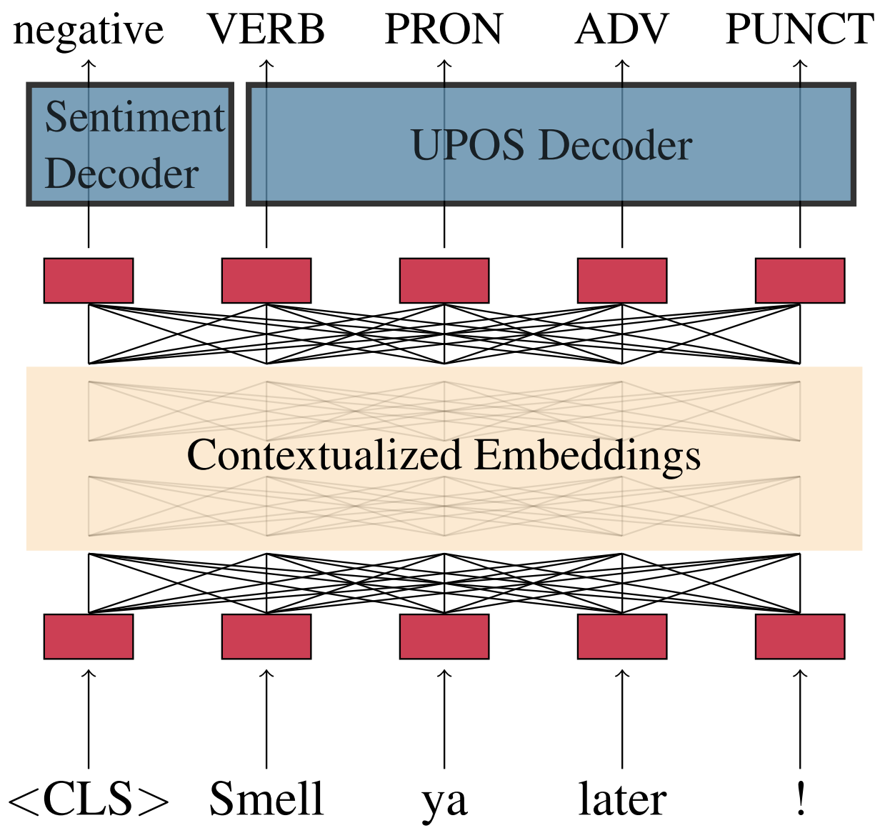

# Before you start...

This documentation presents two workflows:
* Quickly use the author's finetuned models on the temporal datasets, which are contained in this repository by default
* Full reproduction of all the steps of the thesis

If the thesis steps are to be reproduced, it is assumed that the data was prepared as described in the [temporal-data documentation](../temporal-data/).

If the Anaconda environment has not been setup previously, it should be installed and activated.
The following command will create a new environment with the name ``machamp``, download the packages and activate it:

```
conda create -n machamp python=3.8
conda activate machamp
pip install -r requirements.txt
```

Generally, it is assumed that the ``nltk punkt tokenizer`` is installed.
The following script checks if it is installed.
If not, it automatically downloads the tokenizer:

```
bash ../temporal-data/scripts/download_punkt_tokenizer.bash
```


# Download the models

Depending on the workflow, the right models have to be downloaded first.
If the steps of the thesis are to be recreated and the models to be finetuned by hand, the clean models need to be downloaded.
The script ``download_clean_models.bash`` downloads the models and unzips them into the directory hf_models.
After that, it removes the zip files.
This can also be done manually with the download links in the [main README documentation](..#clean-uie-models).

```
bash ./download_clean_models.bash    
```

If the finetuned models are to be used, they have to be downloaded as described in the [main readme](..#uie-models).
Alternatively a script that downloads all the models and saves them in the directory ``finetuned_models`` can be run:

```
bash ./download_finetuned_models.bash
```

Note that this script will download about 16GB.
If only specific models are required, they can be downloaded manually or via wget:

```
wget https://www.fdr.uni-hamburg.de/record/13621/files/large_fullpate_multi.zip
```

The downloaded models should be extracted into a new directory ``finetuned_models``.

[](#download-the-models)
> Graphic of the MaChAmp Architecture [[van der Goot et al., 2020]](#references)


# References

[van der Goot et al., 2020] [van der Goot, R., Üstün, A., Ramponi, A., Sharaf, I., and Plank, B. (2020). Massive choice, ample tasks (machamp): A toolkit for multi-task learning in nlp. arXiv preprint arXiv:2005.14672.](https://arxiv.org/abs/2005.14672)