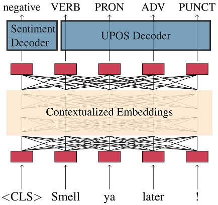

# Before you start...

This documentation presents two workflows:
* Quickly use the author's finetuned models on the temporal datasets, which are contained in this repository by default
* Full reproduction of all the steps of the thesis

If the thesis steps are to be reproduced, it is assumed that the data was prepared as described in the [temporal-data documentation](../temporal-data/).

If the Anaconda environment has not been setup previously, it should be installed and activated.
The following command will create a new environment with the name ``machamp``, download the packages and activate it:

```
conda create -n machamp python=3.8
conda activate machamp
pip install -r requirements.txt
```

Generally, it is assumed that the ``nltk punkt tokenizer`` is installed.
The following script checks if it is installed.
If not, it automatically downloads the tokenizer:

```
bash ../temporal-data/scripts/download_punkt_tokenizer.bash
```

[](#download-the-models)
> Graphic of the MaChAmp Architecture [[van der Goot et al., 2020]](#download-the-models-and-use-them)


# Download the models and use them

There are several scripts to download the finetuned models and unzip them automatically.
The scripts save the models in the directory ``finetuned_models``.
Each of the script downloads both the base and the large models for the model type.

```
bash download_finetuned_bert_models.bash
bash download_finetuned_mbert_models.bash
bash download_finetuned_roberta_models.bash
bash download_finetuned_xlm-roberta_models.bash
```

The models can also be downloaded and saved by hand following the links posted in the [main directory](..) or with the help of the wget command:

```
wget https://www.fdr.uni-hamburg.de/record/13690/files/mbert_tempeval_multi.zip
```

All models together require about 30GB disk space.

To run a model use the ``predict.py`` script.

```
python predict.py finetuned_models/xlm-roberta_large/xlm-roberta-large_tempeval_multi/model.pt ../temporal-data/entity/bio/tempeval_multi/tempeval-test.bio logs/outputfile_tempeval-test.log --device 0 
```


# Full reproduction of the thesis steps

It is assumed that the data has been prepared sufficiently.
The fastest way to do that is to run the script that creates all datasets for the crossvalidation:

```
bash ../temporal-data/scripts/create_all_datasets.bash 
```

More information in the [temporal-data scripts documentation](../temporal-data/scripts/).

MaChAmp works with JSON configuration files to pass the parameters for finetuning.
This requires a configuration file for each dataset and each fold in a crossvalidation.
The script ``bulk_create_machamp_config_files.py`` can be used to generate the configruation files.

```
python bulk_create_machamp_config_files.py \
    --datasets_base_dir ../temporal-data/entity/my_converted_datasets/bio \
    --output_dir configs/temporal_configs
```

The ``--datasets_base_dir`` parameter points to a directory that contains BIO datasets.
The script will automatically generate the configuration files at the ``--output_dir`` location.

An example file looks like this:

```
{
    "TEMPEVAL_MULTI": {
        "train_data_path": "../temporal-data/entity/my_converted_datasets/bio/tempeval_multi/tempeval-train.bio",
        "dev_data_path": "../temporal-data/entity/my_converted_datasets/bio/tempeval_multi/tempeval-val.bio",
        "word_idx": 0,
        "tasks": {
            "ner": {
                "task_type": "seq_bio",
                "column_idx": 1,
                "metric": "span_f1"
            }
        }
    }
}
```

To finetune the models a directory with at least one configuration file needs to be passed to the ``temporal_finetune.bash`` script (it takes one parameter with the location).
This means that one model will be generated for each configuration file.

```
bash temporal_finetune.bash ./configs/crossvalidation_configs_multi
```

It is recommended to use ``nohup`` and ``logfile-appending`` to finetune the models, since the scripts produce many terminal outputs:

```
nohup bash temporal_finetune.bash ./configs/crossvalidation_configs_multi >> logs/xlm-roberta-large_crossvalidation_multi.log &
```

Predefined directories with the required configuration files are available in the [configs directory](configs).

There is another configuration file that is important to adjust the hyperparameters.
The file [configs/params.json](configs/params.json) needs to be adjusted each time the finetuning process is started.
The most important hyperparameter is the model itself.
It can be changed in the first line ``transformer_model``:

```
{
    "transformer_model": "xlm-roberta-base",
    "reset_transformer_model": false,
    "random_seed": 8446,
    "default_dec_dataset_embeds_dim": 12,
    "encoder": {
        "dropout": 0.2,
        "max_input_length": 128,
        "update_weights_encoder": true
    },

    //...

}
```

The following values for the transformer models were used in the thesis:

* xlm-roberta-base
* xlm-roberta-large
* bert-base-cased
* bert-large-cased
* roberta-base
* roberta-large
* bert-base-multilingual-cased

To reproduce the exact steps of the thesis, the priorly mentioned command needs to be repeated with every ``transformer_model`` parameter:

```
bash temporal_finetune.bash ./configs/crossvalidation_configs_multi
```

After the finetuning is completed, the crossvalidation can be evaluated with the ``crossvalidation_evaluation_machamp.py`` script:

```
python crossvalidation_evaluation_machamp.py --base_dir logs
    --dataset_name pate
    --classes multi
    --output_base_dir crossvalidation-output
```

The script searches all the directories in the ``--base_model_dir`` and predict the dataset with all models and checkpoints.
After completion, the script creates a directory in the ``output`` directory.
In the above example the directory is called: ``output/base_tweets_multi_crossvalidation_logfiles``.

This directory contains many files.
The above example produces the following files (only a snapshot is displayed):

* Files that compare the models to each other
    * base_tweets_multi_crossvalidation_best_fold_models.txt
    * base_tweets_multi_crossvalidation_best_models.txt
    * base_tweets_multi_crossvalidation_dataframe_test-all.csv
    * base_tweets_multi_crossvalidation_dataframe_test-all_filtered.csv
    * base_tweets_multi_crossvalidation_dataframe_test-best.csv
    * base_tweets_multi_crossvalidation_dataframe_test-best_filtered.csv
    * base_tweets_multi_crossvalidation_dataframe_val-all.csv
    * base_tweets_multi_crossvalidation_dataframe_val-all_filtered.csv
    * base_tweets_multi_crossvalidation_dataframe_val-best.csv
    * base_tweets_multi_crossvalidation_dataframe_val-best_filtered.csv
    * base_tweets_multi_crossvalidation_full_evaluation_dataframe_test.csv
    * base_tweets_multi_crossvalidation_full_evaluation_dataframe_val.csv
    * base_tweets_multi_crossvalidation_summary.txt
    * base_tweets_multi_crossvalidation_test_average_results.txt
    * base_tweets_multi_crossvalidation_test_std_results.txt
    * base_tweets_multi_crossvalidation_val_average_results.txt
    * base_tweets_multi_crossvalidation_val_std_results.txt
* Files with the predictions for each fold
    * base_tweets_multi_fold_0_checkpoint-470_test_preds_record.txt
    * base_tweets_multi_fold_0_checkpoint-470_test_preds_seq2seq.txt
    * base_tweets_multi_fold_0_checkpoint-470_test_results.txt
    * base_tweets_multi_fold_0_checkpoint-470_val_preds_record.txt
    * base_tweets_multi_fold_0_checkpoint-470_val_preds_seq2seq.txt
    * base_tweets_multi_fold_0_checkpoint-470_val_results.txt
* Files that contain the mispredictions and their analysis
    * base_tweets_multi_fold_0_checkpoint-470_error_analysis_test.txt
    * base_tweets_multi_fold_0_checkpoint-470_error_analysis_val.txt
    * base_tweets_multi_fold_0_checkpoint-846_error_analysis_test.txt
    * base_tweets_multi_fold_0_checkpoint-846_error_analysis_val.txt


# References

[van der Goot et al., 2020] [van der Goot, R., Üstün, A., Ramponi, A., Sharaf, I., and Plank, B. (2020). Massive choice, ample tasks (machamp): A toolkit for multi-task learning in nlp. arXiv preprint arXiv:2005.14672.](https://arxiv.org/abs/2005.14672)