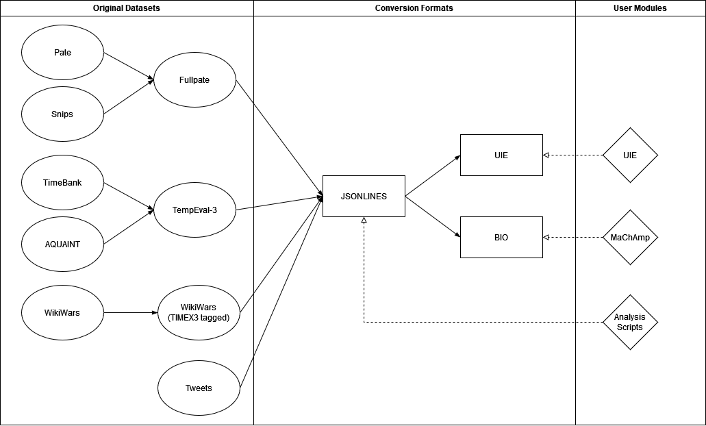

# Overview

This documentation describes how to work with this directory.
In general, it is recommended to prepare the data first before working with the [UIE](../uie) and [MaChAmp](../machamp) directories to work with the models.
It is also recommended to work with the conventions set by this documentation.
In particular, the freshly converted datasets must be saved in the correct directory to make using all the scripts in this repository easy.

This directory contains already converted datasets in most of the required formats.
It is possible to use the pre-converted datasets with the models (both UIE and MaChAmp).
If the whole cross-validation process is to be reproduced, it is required to convert the datasets with the provided scripts because the cross-validation folds are not available in this directory (they can be easily produced with the provided scripts).

The structure of this directory is the following:

```text
temporal-data
├── ..                      # Main directory
├── dataset-statistics      # Contains files with statistics for each of the datasets
├── entity                  # Contains all the converted datasets used in the thesis
├── original_datasets       # Contains the original versions of the datasets
├── relation                # Contains the temporal relation extraction datasets in UIE format
├── scripts                 # Contains all the scripts to convert the data to any format
```

To use the scripts in the [scripts directory](scripts), it is required that the required Python packages are downloaded.
For this, it is recommended to set up Anaconda as described in the [main directory](..).
The scripts run with either the MaChAmp or the UIE environment.
For each of the original datasets, a converter script has been written that converts the data to a JSONLINE format (these are in the [jsonlines conversion directory](scripts/jsonlines-conversion-scripts/)).
This format can not directly be used by either UIE or MAChAmp, but further scripts can use this format (for example, [dataset analysis scripts](scripts/dataset-analysis-scripts/) that calculate the statistics for each dataset).
Furthermore, it is important to first download the [nltk punkt tokenizer](https://www.nltk.org/api/nltk.tokenize.punkt.html).
The [scripts directory](scripts) contains a Python script that downloads the punkt tokenizer automatically.


# Temporal Datasets

The thesis uses four datasets: Fullpate, TempEval-3, WikiWars, and Tweets.
The Fullpate dataset is originally called PATE [[Zarcone et al., 2020]](#References), but in the context of this repository, the name Fullpate is used.
The reason for this is that the Fullpate dataset consists of two pieces: Snips and Pate.
These pieces have a different origin and format structure.
In terms of temporal semantics and sentence structure, these datasets show clear differences.
Still, both pieces label temporal expressions with one of the four temporal classes: date, time, duration, and set.
Similarly, the TempEval-3 dataset [[UzZaman et al., 2013]](#references) consists of two pieces, namely TimeBank and AQUAINT.

The other two datasets are Tweets [[Zhong et al., 2017]](#references) and WikiWars [[Mazur and Dale, 2010]](#references).
WikiWars originally was only TIMEX2 tagged, i.e., it contains no information on temporal classes.
In the work by Derczynski et al. [[Derczynski et al., 2012]](#references), the dataset was labeled with TIMEX3 temporal classes.

Since TempEval-3 and Fullpate consist of subsets that have different formats, there are converter scripts for each of the subsets as well as their union.
The original datasets are in the [original_datasets directory](original_datasets). 


# Data format

Three target formats are used in this repository: JSONLINES, UIE, and BIO.
Furthermore, each of the original datasets has its format.
Most of them follow an XML structure, despite the PATE dataset [[Zarcone et al., 2020]](#References), which consists of two different JSON formats.
Each of the target formats is described in the following sections.

[](#temporal-datasets)
> The graphic shows the datasets, formats, and the relations between them.


## JSONLINES format

The JSONLINES format is used as a base to convert to the other formats, and the dataset analysis scripts are used to create statistics.
Each line of a document represents a JSON entry.
For visualization purposes, the following code is formatted:

```
{
  "text": "Shift the group meeting on Monday the 6th of January to 9:30 am.",
  "tokens": ["Shift", "the", "group", "meeting", "on", "Monday", "the", "6th", "of", "January", "to", "9:30", "am", "."],
  "entity": [
    {
      "text": "Monday the 6th of January",
      "type": "date",
      "start": 5,
      "end": 9
    },
    {
      "text": "9:30 am",
      "type": "time",
      "start": 11,
      "end": 12
    }
  ]
}
```

The first entry is the full text, and the second represents the tokens.
After that follows a list of entities with a temporal type and token start/end indexes. 


## BIO format (MaChAmp)

The BIO format uses B and I tags for each temporal class and an O tag as a separator.
This leads to 9 possible BIO tags (B-date, I-date, B-time, I-time, ..., I-set, O).
The data is structured vertically with one token/tag pair per line.
The token is split from the tag with a tab character.
An entity begins with a B tag, continues with an I tag, and is closed with an O tag.
The following example shows how temporal entities are formatted:

```
Book	O
a	O
train	O
ticket	O
for	O
11:45	B-TIME
am	I-TIME
on	O
monday	B-DATE
```


## UIE format

The UIE format is the most complex of the three.
It is generated with one of the original UIE scripts and requires configuration files for each dataset.
The format is similar to JSONLINES with the "text" and "tokens" keys.
Entities are encoded very similarly.
The only differences are the ``begin`` and ``end`` keys in the JSONLINE format and a list of ``offset`` indexes in the UIE format.
Similarly to JSONLINES, each data entry gets its own line.
The following example was formatted for visualization purposes:

```
{
  "text": "Add my appointment with Pearl Hair Salon at 10:30 am on February 2nd .",
  "tokens": ["Add", "my", "appointment", "with", "Pearl", "Hair", "Salon", "at", "10:30", "am", "on", "February", "2nd", "." ],
  "record": "<extra_id_0> <extra_id_0> time <extra_id_5> 10:30 am <extra_id_1> <extra_id_0> date <extra_id_5> February 2nd <extra_id_1> <extra_id_1>",
  "entity": [
    {
      "type": "time",
      "offset": [
        8,
        9
      ],
      "text": "10:30 am"
    },
    {
      "type": "date",
      "offset": [
        11,
        12
      ],
      "text": "February 2nd"
    }
  ],
  "relation": [],
  "event": [],
  "spot": [
    "time",
    "date"
  ],
  "asoc": [],
  "spot_asoc": [
    {
      "span": "10:30 am",
      "label": "time",
      "asoc": []
    },
    {
      "span": "February 2nd",
      "label": "date",
      "asoc": []
    }
  ]
}
```

The record line is required by UIE and encodes the order of the temporal expressions.
"Spot" refers to entities and is a part of the UIE-SEL structure (structural extraction language).
The temporal data does not utilize relations and events.
The "spot_asoc" part is an internal representation of the SEL structure.
The information in the JSONLINES format is already enough to use the [UIE converter scripts](scripts/uie-conversion-scripts/) to convert to its unique format.

UIE also requires a so-called SSI (structural schema instructor) for each dataset.
The SSI encodes what information to look for in the given dataset.
Since all datasets follow the same format, the SSI is the same.
To be more precise, the single-class datasets and the multi-class datasets have different SSIs.
The SSIs are generated automatically by the UIE converter and do not need to be manually adjusted.
UIE saves the SSI in a file called ``record.schema``.

```
["date", "duration", "time", "set"]
[]
{"date": [], "duration": [], "time": [], "set": []}
```

For example, this SSI is from the [TempEval-3 dataset](entity\uie-format\tempeval_multi) and tells UIE that there are four entity classes to look for, i.e., date, duration, time, and set.
Furthermore, it tells UIE that there are no relations and events to look for in the given dataset.


# Conversion scripts

The [scripts](scripts/uie-conversion-scripts/) directory contains multiple folders with Python scripts for different purposes.

* The [jsonlines converters](scripts/jsonlines-conversion-scripts/) convert the original datasets to the JSONLINE format
* The [bio conversion scripts](scripts/bio-conversion-scripts/) are used to convert JSONLINES to BIO
* The [UIE conversion scripts](scripts/uie-conversion-scripts/) convert JSONLINES to the UIE format. They require configuration files, which can be automatically generated with the [YAML creator script](scripts/uie-conversion-scripts/data_config_yaml_creator.py).

The usage of the scripts is described in detail in the [scripts directory](scripts).


# Original datasets sources

All original datasets can be found online, but they are also uploaded in the [original_datasets directory](original_datasets).
For example, the following links can be used for download:

* [Fullpate (Pate and Snips)](https://zenodo.org/records/3697930#.ZBwzbi00hQI):
* [WikiWars (tagged)](https://github.com/satya77/Transformer_Temporal_Tagger/blob/master/data.zip)
* [Tweets](https://github.com/xszhong/syntime/tree/master/syntime/resources/tweets)
* [TimeBank + AQUAINT](https://github.com/satya77/Transformer_Temporal_Tagger/blob/master/data.zip)


# How to add new datasets?

To use either MaChAmp or UIE on new datasets, writing a converter script similar to the ones in the [jsonlines converter directory](scripts/jsonlines-conversion-scripts/) is recommended.
After that, the [BIO converter](scripts/bio-conversion-scripts/) can be used to convert to the MaChAmp format or the [UIE converter](scripts/uie-conversion-scripts/) to convert to the UIE format.
Furthermore, UIE requires the generation of a [YAML configuration file](scripts/uie-conversion-scripts/data_config/entity/) and another dataset-specific [converter module](scripts/uie-conversion-scripts/universal_ie/task_format/).
The [converter module directory](scripts/uie-conversion-scripts/universal_ie/task_format/) contains example scripts (e.g. [fullpate.py](scripts/uie-conversion-scripts/universal_ie/task_format/fullpate.py) or [tweets.py](scripts/uie-conversion-scripts/universal_ie/task_format/tweets.py)).


# References

* [UzZaman et al., 2013] [UzZaman, N., Llorens, H., Derczynski, L., Allen, J., Verhagen, M., and Pustejovsky, J. (2013). Semeval-2013 task 1: Tempeval-3: Evaluating time expressions, events, and temporal relations. In Second Joint Conference on Lexical and Computational Semantics (* SEM), Volume 2: Proceedings of the Seventh International Workshop on Semantic Evaluation (SemEval 2013), pages 1–9. ](https://aclanthology.org/S13-2001.pdf)

* [Derczynski et al., 2012] [Derczynski, L., Llorens, H., and Saquete, E. (2012). Massively increasing timex3 resources: a transduction approach. arXiv preprint arXiv:1203.5076.](https://arxiv.org/abs/1203.5076)

* [Mazur and Dale, 2010] [Mazur, P. and Dale, R. (2010). Wikiwars: A new corpus for research on temporal expressions. In Proceedings of the 2010 conference on empirical methods in natural language processing, pages 913–922](https://aclanthology.org/D10-1089.pdf)

* [Zhong et al., 2017] [Zhong, X., Sun, A., and Cambria, E. (2017). Time expression analysis and recognition using syntactic token types and general heuristic rules. In Proceedings of the 55th Annual Meeting of the Association for Computational Linguistics (Volume 1: Long Papers), pages 420–429, Vancouver, Canada. Association for Computational Linguistics.](https://aclanthology.org/P17-1039/)

* [Zarcone et al., 2020] [Zarcone, A., Alam, T., and Kolagar, Z. (2020). Pâté: a corpus of temporal expressions for the in-car voice assistant domain. In Proceedings of the Twelfth Language Resources and Evaluation Conference, pages 523–530.](https://aclanthology.org/2020.lrec-1.66/)
