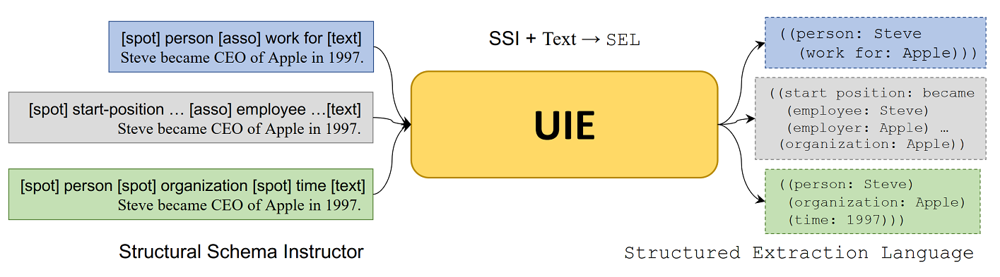

# Before you start...

This documentation presents two workflows:
* Quickly use the author's finetuned models on the temporal datasets, which are contained in this repository by default
* Full reproduction of all the steps of the thesis

If the thesis steps are to be reproduced, it is assumed that the data was prepared as described in the [temporal-data documentation](../temporal-data/).

If the Anaconda environment has not been setup previously, it should be installed and activated.
The following command will create a new environment with the name ``uie``, download the packages and activate it:

```
conda create -n uie python=3.8
conda activate uie
pip install torch==1.8.0+cu111 torchvision==0.9.0+cu111 torchaudio==0.8.0 -f https://download.pytorch.org/whl/torch_stable.html
pip install -r requirements.txt
```

Generally, it is assumed that the ``nltk punkt tokenizer`` is installed.
The following script checks if it is installed.
If not, it automatically downloads the tokenizer:

```
bash ../temporal-data/scripts/download_punkt_tokenizer.bash
```


# Download the models

Depending on the workflow, the right models have to be downloaded first.
If the steps of the thesis are to be recreated and the models to be finetuned by hand, the clean models need to be downloaded.
The script ``download_clean_models.bash`` downloads the models and unzips them into the directory hf_models.
After that, it removes the zip files.
This can also be done manually with the download links in the [main documentation](..#clean-uie-models).

```
bash ./download_clean_models.bash    
```

Note that this script will download files of about 16GB in size.
If only specific models are required, they can be [downloaded manually](..#UIE-models) or via wget:

```
wget https://www.fdr.uni-hamburg.de/record/13621/files/large_fullpate_multi.zip
```

The downloaded models should be extracted into a new directory with the name ``finetuned_models``.

[](#download-the-models)
> Graphic of the UIE Architecture [[Lu et al., 2022]](#references) 


# Quickstart Workflow

To run the finetuned models, there are two options:
* Inference on a temporal dataset
* Inference on a self-typed text

The ``inference.py`` script loads the model and generates the prediction on the selected dataset.
For example:

```
python inference.py --data ../temporal-data/entity/uie-format/wikiwars-tagged_multi \
    --model finetuned_models/large/wikiwars_multi
    --output_dir results
```

The command creates a new directory ``results`` and predicts the test and validation datasets of WikiWars with the WikiWars model.
The full synopsis of the ``inference.py`` script is:

```
inference.py [--data DATA] [--model MODEL] [--output_dir OUTPUT_DIR] [--max_source_length MAX_SOURCE_LENGTH] [--max_target_length MAX_TARGET_LENGTH] [--batch_size BATCH_SIZE] [-c MAP_CONFIG] [--decoding DECODING] [--verbose] [--match_mode {set,normal,multimatch}]
```

The most important parameters are ``--data`` and ``--model``.
For the other values the default parameters are in many cases sufficient.

To do inference on self-typed text use:

```
python inference_sentence.py --model finetuned_models/large/wikiwars_multi
```

The script will load the model and prompt you to enter a sentence.


# Full reproduction of the thesis steps

It is assumed that the data has been prepared sufficiently.
The fastest way to do that is to run the script that creates all datasets for the crossvalidation:

```
bash ../temporal-data/scripts/create_all_datasets.bash 
```

More information in the [temporal-data scripts documentation](../temporal-data/scripts/).

To finetune the models, one of several bash scripts can be chosen:
* Finetune the main models
    * ``run_quickstart_temporal_finetuning_uie_base.bash``
    * ``run_quickstart_temporal_finetuning_uie_large.bash``
* Crossvalidation
    * ``run_temporal_finetuning_uie_base_full_multi.bash``
    * ``run_temporal_finetuning_uie_base_full_single.bash``
    * ``run_temporal_finetuning_uie_large_full_multi.bash``
    * ``run_temporal_finetuning_uie_large_full_single.bash``

The crossvalidation finetunes the 10 folds seperately, while the quickstart scripts only finetune one fold per model.
To change the finetuning dataset target, change the ``dataset_names`` array inside the bash script.
Although this is only necessary if special constelations of dataset-finetuning is to be tested.
The six above mentioned scripts were chosen to be sufficient to reproduce the steps of the thesis.

It is recommended to run scripts with ``nohup`` and to create output logs.
For example:

```
nohup bash run_temporal_finetuning_uie_base_full_multi.bash >> ./finetuning-output.log &
```

The finetuned models and the logs can be found in the ``output`` directory.
If the crossvalidation approach is chosen, the output can be very large.
For example, the finetuning of 10 folds with the base model requires about 30GB in space.

Once the 10 folds have been finetuned, the script that calculates the results of the crossvalidation can be started:

```
python crossvalidation_evaluation.py --base_model_dir ./output \
    --base_data_dir ../temporal-data/entity/my_converted_datasets/uie-format \
    --model_size base \
    --dataset_name tweets \
    --classes multi
```

The script searches all the directories in the ``--base_model_dir`` and predicts the dataset with all models and checkpoints.
After completion, the script creates a directory in the ``output`` directory.
In the above example the directory is called: ``output/base_tweets_multi_crossvalidation_logfiles``.

The above example produces the following files (only a snapshot is displayed):

* Files that compare the models to each other
    * base_tweets_multi_crossvalidation_best_fold_models.txt
    * base_tweets_multi_crossvalidation_best_models.txt
    * base_tweets_multi_crossvalidation_dataframe_test-all.csv
    * ...
    * base_tweets_multi_crossvalidation_val_average_results.txt
    * base_tweets_multi_crossvalidation_val_std_results.txt
* Files with the predictions for each fold
    * base_tweets_multi_fold_0_checkpoint-470_test_preds_record.txt
    * base_tweets_multi_fold_0_checkpoint-470_test_preds_seq2seq.txt
    * base_tweets_multi_fold_0_checkpoint-470_test_results.txt
    * base_tweets_multi_fold_0_checkpoint-470_val_preds_record.txt
    * base_tweets_multi_fold_0_checkpoint-470_val_preds_seq2seq.txt
    * base_tweets_multi_fold_0_checkpoint-470_val_results.txt
* Files that highlight all the mispredictions together with some statistics
    * base_tweets_multi_fold_0_checkpoint-470_error_analysis_test.txt
    * base_tweets_multi_fold_0_checkpoint-470_error_analysis_val.txt
    * base_tweets_multi_fold_0_checkpoint-846_error_analysis_test.txt
    * base_tweets_multi_fold_0_checkpoint-846_error_analysis_val.txt


# UIE Output files

The ``inference.py`` and ``crossvalidation_evaluation.py`` scripts produce two types of output files:

* seq2seq files e.g. ``test_preds_seq2seq.txt``
* record files e.g. ``test_preds_record.txt``

Both file-types consist of as many lines as the dataset they are based on.
Each line is the output of the corresponding dataset line.
The seq2seq files are an internal representation that UIE uses to produce the graph structure.
It encodes the information extraction targets and their order.
This example means that UIE found one time-entity in the corresponding input sentence.

```
<extra_id_0><extra_id_0> time<extra_id_5> 9 am April 11th<extra_id_1><extra_id_1>
```

The ``<extra_id>`` tokens work like brackets around the information extraction targets.
UIE uses the seq2seq representation to generate the record.
The record contains all extraction targets i.e. temporal entities and their exact position in the input.
The following JSON structure is normally written as a single line.
It is formatted for visualization purposes:

```
{
    "entity": {
        "offset": [
            [
                "time",
                [
                    5,
                    6,
                    7,
                    8
                ]
            ]
        ],
        "string": [
            [
                "time",
                "9 am April 11th"
            ]
        ]
    },
    "relation": {
        "offset": [],
        "string": []
    },
    "event": {
        "offset": [],
        "string": []
    }
}
```

The record for this line contains one entitiy that has the index positions 5 to 8, represents a "time" class and consists of the text "9 am April 11th".

The seq2seq and record entries refer to the following dataset line (once again formatted for a better visualization):

```
{
    "text": "Move Bon Bon Salon to 9 am April 11th .",
    "tokens": [
        "Move",
        "Bon",
        "Bon",
        "Salon",
        "to",
        "9",
        "am",
        "April",
        "11th",
        "."
    ],
    "record": "<extra_id_0> <extra_id_0> time <extra_id_5> 9 am April 11th <extra_id_1> <extra_id_1>",
    "entity": [
        {
            "type": "time",
            "offset": [
                5,
                6,
                7,
                8
            ],
            "text": "9 am April 11th"
        }
    ],
    "relation": [],
    "event": [],
    "spot": [
        "time"
    ],
    "asoc": [],
    "spot_asoc": [
        {
            "span": "9 am April 11th",
            "label": "time",
            "asoc": []
        }
    ]
}
```

For this specific example the model predicted correctly, since the record matches the ground truth (sentence contains one time entity from index 5 to 8). 

Furthermore, UIE produces the result files such as ``test_results.txt``.
These files contain the Precision, Recall and F1-score values for the dataset.

The crossvalidation results contain ``seq2seq``, ``records`` and ``results`` for the test and evaluation data for every model in every fold.
Furthermore, they contain ``error analysis`` files that list all the mispredictions.
The other files compare the models to each other, select the best models per fold and calculate the averages and standard deviations.


# References

* [Lu et al., 2022] [Lu, Y., Liu, Q., Dai, D., Xiao, X., Lin, H., Han, X., Sun, L., and Wu, H. (2022). Unified structure generation for universal information extraction. arXiv preprint arXiv:2203.12277.](https://aclanthology.org/2022.acl-long.395/)